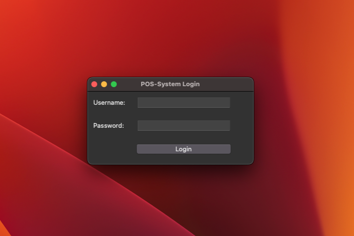
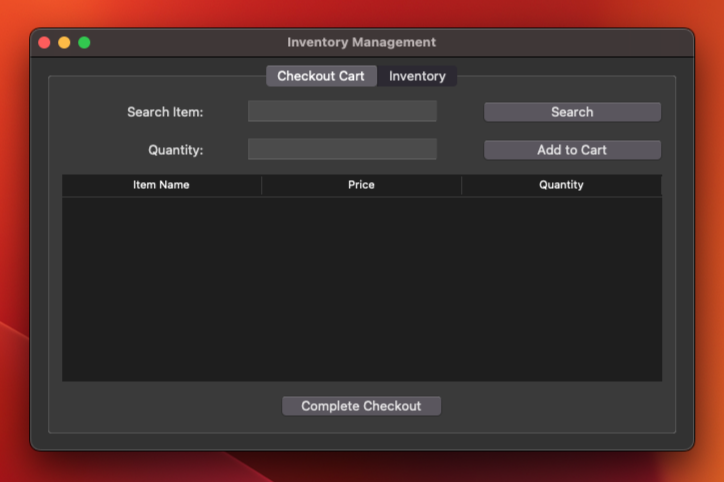
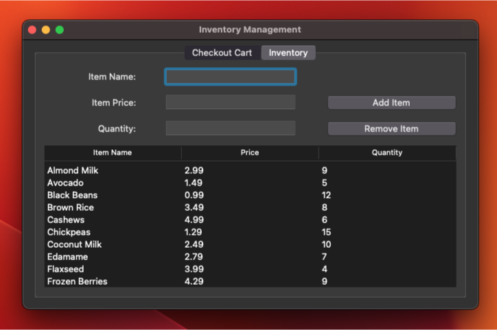

# POS System




## Introduction
The Inventory Management System is a Python application with a graphical user interface (GUI) implemented using the Tkinter library. It allows users to manage an inventory, search for items, add them to a cart, and complete the checkout process.

## Features
- Add and remove items from the inventory
- Search for items by name
- Add items to the cart with a specified quantity
- Complete the checkout process
- Generate receipts for the purchased items

## Installation
1. Clone the repository:
    ```
    git clone https://github.com/mannpatel2/inventory-management.git
    ```
2. Install the dependencies:
    ```
   pip install pandas
   pip install openpyxl
   pip install csv
   ```

## Usage
1. Locate `Model.py` file and change the path to your own directory:
   ```
   INVENTORY_FILE_PATH = ' PUT YOUR DIRECTORY PATH OF THIS PROJECT /POS-System/Data/Inventory.xlsx'
   USERS_FILE_PATH = ' PUT YOUR DIRECTORY PATH OF THIS PROJECT /POS-System/Data/users.csv'
   ``` 

2. Run the `Client.py` script to start the application:
    ```
   python Client.py
   ```
3. The login screen will appear. Enter the username and password to log in.
4. Use the GUI to manage the inventory, search for items, add them to the cart, and complete the checkout process.

## Screenshots
- Include screenshots or GIFs demonstrating the usage of the application.

## File Structure
- `Client.py`: The main entry point of the application.
- `Login.py`: The module that contains the Login functionality and Login GUI.
- `Model.py`: The module that contains the functionality for the inventory management.  
- `View.py`: The module that Contains the inventory Managements GUI and Checkout GUI and their respective functionality.
- `users.csv`: The CSV file that stores the usernames and passwords for authentication.
- `Inventory.xlsx`: The xlsx file that stores the Inventory Items, its quantity, and its price.

## Dependencies
- Python 3.x
- pandas
- tkinter
- openpyxl
- csv

## Acknowledgments
- [tkinter documentation](<https://docs.python.org/3/library/tk.html>) for providing tkinter documentation 
- [Tkinter Course](<https://www.youtube.com/watch?v=YXPyB4XeYLA>) for providing additional help
- [RajRawat112](<https://github.com/RajRawat112>) for helping with this project
   
